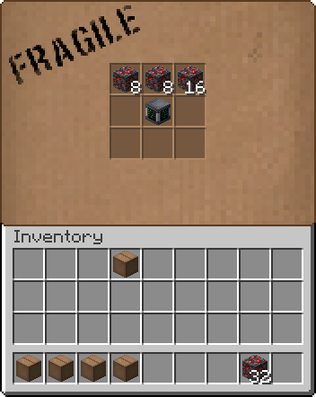

<h1 align="center">
  <b>screenbuilder</b>
</h1>
<div align="center">
  👷🏼 A library for creating server-side GUIs for Minecraft
</div>
<div align="center">
  <sub>
    Coded with ❤️ by <a href="#authors">Jelle De Loecker</a>.
  </sub>
</div>

## Introduction

This library allows you to quickly create server-side GUIs for Minecraft Fabric, without the client needing any mod.

It is meant to be used together with [PolyMC](https://github.com/TheEpicBlock/PolyMc), which automatically translates custom items & blocks to textured vanilla items so vanilla clients can see them with a resource pack.

Screenbuilder currently only supports 9x6 inventory screens (which are the biggest ones available in-game).
These can then be textured by using the "custom item" trick: an item in the top left slot is retextured to a GUI, which then overflows its slot and is overlayed over the entire inventory.
(Using font magic instead might be added later, but for now this works perfectly for my usecase).

## Usage

You can add Screenbuilder to your dependencies like this:

```
repositories {
	maven { url 'https://maven.blackblock.rocks/releases' }
}

dependencies {
	modImplementation include("rocks.blackblock:screenbuilder:0.1.0")
}
```

## Example

There's a short example in the `testmod` directory: there I created a "cardboard box" which acts as a small shulker box:



This was a pretty basic example, here is a GIF of a more complex one that uses selects & string inputs:


It's harder to show example code of this because of how interweaved it is with my personal mods.
But I'll try to create some more examples ASAP.

Here's a small code example though:

Instead of creating a new class for each GUI, they can be made on-the-fly:

```java

// Names do not have to be unique, but they might be used for custom textures
Screenbuilder GUI = new ScreenBuilder("menu");

// The namespace of your mod
GUI.setNamespace("blackblock");

// By just providing a boolean value of `true`,
// it will automatically create a GUI item & look for the texture in
// {namespace}/textures/gui/{name}.png - So in this case that will be
// blackblock/textures/gui/menu.png
GUI.useCustomTexture(true);

// ScreenBuilder instances can act as a sort of blueprint:
// create them at init and then reuse them at will.
// This is actually the default value, so it doesn't need to be called.
// However, sometimes you want to create a GUI on-the-fly, with custom button placements and such,
// it would not make sense for the system to clone those again, so then this should be set to false
GUI.setCloneSlots(true);

// GUIs are always made based on 9x6 inventories.
// The first number (in buildSlot call) is the index of the slot on the screen,
// the second number (mapInventory) is the index inside the inventory to link this slot to
// The `allow()` call will make it so only items that are decendants of the PassportDataCardItem class are allowed
// And we'll only ever allow a stack size of 1
GUI.buildSlot(4).mapInventory(0).allow(PassportDataCardItem.class).maxStackSize(1);

// Add a "button" at slot index 11
ButtonWidgetSlot add = GUI.addButton(11);

// Here you can set the item to use as an icon
// In this example it's something I made for one of my own mods
add.setStack(BlackblockTools.GUI_PLUS);

// You can set the title of the button, which is visible on hover
// (This basically sets the display title of the item)
add.setTitle("Add game settings...");

// Now you can choose what to do when someone left clicks on it
add.addLeftClickListener((screen, slot) -> {


});

// Add another button at index 15
ButtonWidgetSlot edit = GUI.addButton(15);
edit.setStack(BlackblockTools.GUI_EDIT);
edit.setTitle("Edit game's name...");

// Another click listener
edit.addLeftClickListener((screen, slot) -> {

    // Create a string input (this will use the anvil GUI)
    StringInput input = new StringInput();
    
    // This will be the title at the top of the anvil gui
    input.setDisplayName("Your game's name...");

    // Actually show the input
    screen.pushScreen(input);

    // Once the player accepts the new name, this lambda will be called
    input.setRenamedListener((screen1, value) -> {
        System.out.println("New value is: " + value);
    });
});

// This "registers" the GUI you just made.
// This is actually only needed if you use custom textures
GUI.register();

return GUI;
```

## Authors
- **Jelle De Loecker** -  *Follow* me on *Github* ([:octocat:@skerit](https://github.com/skerit)) and on  *Twitter* ([🐦@skeriten](http://twitter.com/intent/user?screen_name=skeriten))

See also the list of [contributors](https://github.com/skerit/screenbuilder/contributors) who participated in this project.
